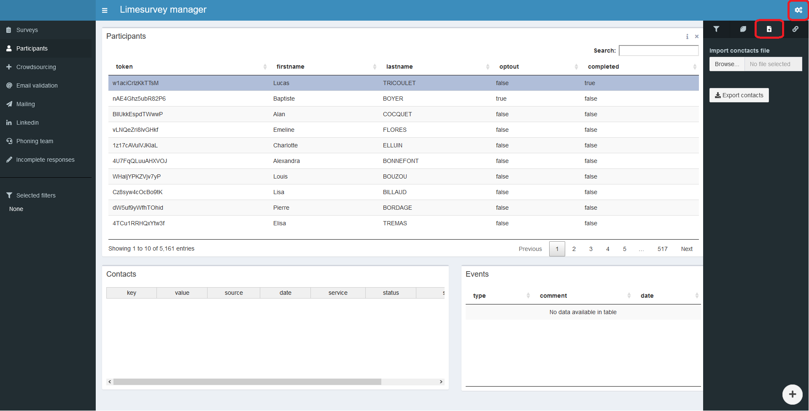
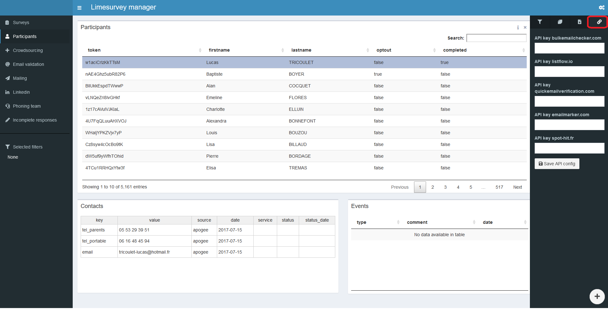
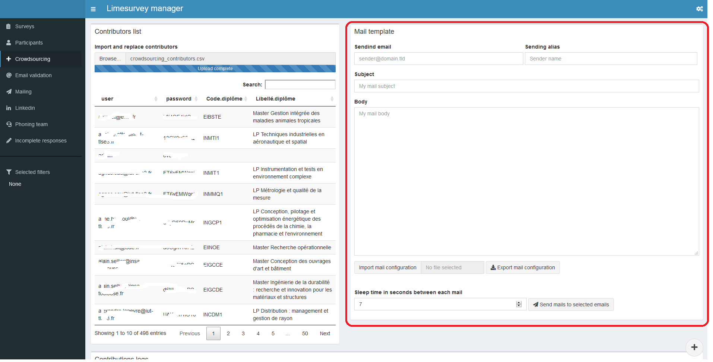
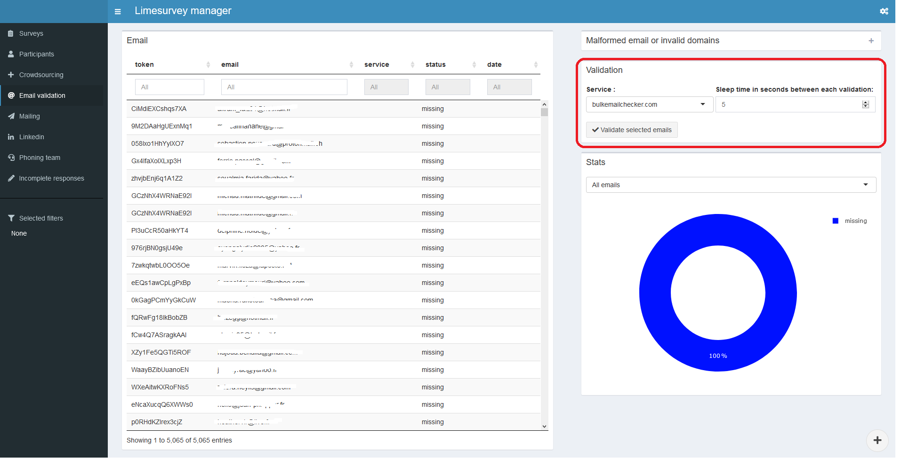

```{r setup, include = FALSE}
knitr::opts_chunk$set(
  collapse = TRUE,
  comment = "#>"
)
```

# Installation

Le package `survey.admin` enregistre les données des enquêtes dans une base SQLite.

Voici un exemple de script permettant de lancer l'application shiny :

```{r, eval=FALSE}
credentials <- data.frame(
  user = c("admin"),
  password = c("ovetoul3")
)

survey.admin::run_app(
  sqlite_base = "/home/shiny/enquete-ip.sqlite",
  cron_responses = "/home/shiny/cron_responses.rda",
  credentials = credentials
)
```

Ci-dessous sont présentés les 3 arguments en entrée de l'application : 

## 1. sqlite_base

L'argument `sqlite_base` déclare le chemin vers la base SQLite de travail. Afin de rendre la base de données accessible en écriture par l'application shiny, celle-ci doit être placée dans le dossier `/home/shiny`.

Lorsque l'on travaille sur une nouvelle campagne, il faut également veiller à repartir d'une nouvelle base de données (et sauvegarder celle de la campagne précédente si nécessaire).

## 2. cron_responses

Pour certains de ses modules, l'application `survey.admin` se base sur le statut de réponse des participants en direct pour les enquêtes administrées. Par exemple, lors d'un mailing aux participants, on souhaite écarter ceux ayant déjà répondu au questionnaire, même très récemment.

Afin d'avoir au fil de l'eau la mise à jour du statut de répondant, un script Linux cron tourne en tâche de fond toutes les minutes afin d'écrire dans un fichier de données `rda`. C'est ce fichier de données qui est lu par l'application `survey.admin`.

L'objectif est d'avoir un accès immédiat sans chargement de ces données.
Sous Windows, le chargement est donc plus long au démarrage en l'absence de cette tâche de fond.

L'application `survey.admin` se charge toute seule de lancer ce script cron.
L'argument `cron_responses` déclare le chemin de sauvegarde de ce fichier de données `rda`. 

## 3. credentials

Il s'agit du data.frame renseignant les utilisateurs de l'application qui est protégée derrière un login/password car des données personnelles y sont accessibles. 

# Utilisation de `survey.admin`

Les sections suivantes présentes les différentes fonctionnalités proposées par l'application. 

## Saisie des identifiants limesurvey

Il est tout d'abord nécessaire de se connecter à l'instance Limesurvey sur lesquelles sont stockées les enquêtes que l'on souhaite administrer :


- Limesurvey API : URL du point API Limesurvey (qui doit être sous la forme https://{domaine}/index.php/admin/remotecontrol)
- Login : Login Limesurvey
- Mot de passe : Mot de passe Limesurvey

## Ajout des enquêtes à administrer

L'écran d'accueil de l'application apparait ensuite et permet d'importer les enquêtes que l'on souhaite administrer :


Après le chargement, on obtient un tableau des enquêtes enregistrées :


## Participants

Le menu **Participants** permet de consulter les informations relatives aux individus à enquêter.

Un premier tableau affiche les informations extraites de Limesurvey.
Il s'agit d'un tableau non-éditable basé sur le package `DT`.


Par défaut, 5 champs sont affichés : 

- `token` : Identifiant limesurvey
- `firstname` : Prénom de l'enquêté
- `lastname` : Nom de l'enquêté
- `optout` : Témoin "Ne plus contacter"
- `completed` : Témoin de réponse à l'enquête

On peut en ajouter avec le bouton `More` parmi les attributs des enquêtes :


Deux autres tableaux en dessous permettent de stocker :

### 1. Les coordonnées des participants

Au premier démarrage, aucune coordonnée n'est disponible dans l'application.
Ces informations (email et téléphone) sont effet gérées de manière distincte en raison de leur caractère multiple pour un seul individu.

Pour les importer, on se dirige vers le menu de droite :



Le fichier à importer au format CSV contient les champs suivants:

- `token` : Identifiant limesurvey
- `key` : type de champ de contact
- `value` : Valeur de contact

Ce tableau est éditable, il est basé sur le package `rhandsontable`.

Les champs supplémentaires peuvent être ajoutés :

- `date` : Date de création de la valeur
- `service` : Service de validation pour un email, le cas échéant
- `status` : Statut de validité, le cas échéant
- `status_date` : Date de vérification de validité, le cas échéant

Ces champs supplémentaires sont automatiquement créés en base, même s'ils ne sont pas dans le fichier CSV.


### 2. La liste des évènement de contact qui sont intervenus

Cette table se remplit automatiquement avec les évènement suivants :

- Mailing aux participants
- Prise de contact lors du phoning

Il s'agit d'un tableau non-éditable basé sur le package `DT`.

## Configuration

Avant de passer à la suite des menus de la barre latérale, il est intéressant de revenir au menu de configuration en haut à droite de l'interface.

### Filtres

Hormis le tableau des enquêtes dans le menu d'accueil, il est possible de filtrer tous les tableaux de l'application `survey.admin`.


Par défaut, trois filtres sont disponibles :

- `Survey title` : Enquête limesurvey
- `OptOut` : Témoin "Ne plus contacter"
- `Completed` : Témoin de réponse à l'enquête

Cela est par exemple lorsque l'on souhaite écarter d'un mailing les individus ayant souhaité ne plsu être contacté ou ayant déja répondu à l'enquête.

### Informations de connexion Limesurvey

Dans ce menu, il est possible de mettre ses informations de connexion à Limesurvey.


### Import/export des contacts de participants

Comme vu dans la section précédente relative aux participants, on utilise ce menu pour importer les coordonnées des participants.

Il est également possible d'exporter au même format ces informations de contact, pour sauvegarde par exemple.

### Connexion à des API tierce

Certaines fonctionalités de `survey.admin` se basent sur des services externes, notamment la validation d'email.



Si l'on souhaite utiliser l'un de ces services, il est nécessaire de saisir les clés API requises.

## Ajout de contributeurs

Avant de lancer le mailing auprès des participants, il existe peut-être des contributeurs permettant d'enrichir la base de contacts.

Dans le cas des enquêtes d'insertion professionnelle, ce module peut être utilisé pour communiquer avec les responsables et secrétaires de formation afin de consolider la base de contacts des anciens diplômés.

Pour rendre accessible ce module, il est nécessaire d'installer le package `survey/crowdsourcing` :

```{r, eval=FALSE}
remotes::install_github("ove_ut3/survey.crowdsourcing")
```

L'onglet `Crowdsourcing` de `survey.admin` permet de configurer l'accès aux coordonnées par les contributeurs au moyen d'une application shiny dédiée.


### `Crowdsourcing columns` : Configuration des champs visibles par les contributeurs

Le premier tableau permet de configurer quel champs des participants seront :

- affichés (`display`),
- dans quel ordre (`order`),
- éditables (`edit`),
- serviront de filtres (`filter`),
- et/ou serviront de clé pour l'accès des contributeurs à l'application (`restriction`)


Les champs déclarés en `restriction` correspondent à des champs qui devront apparaître dans la table d'import des contributeurs.
Pour les enquêtes d'insertion professionnelle, les contributeurs étant liés aux formations (responsable ou secrétaire), on utilise les attributes `Code diplôme` et `Libellé diplôme`.

### `Contributors list` : Liste des contributeurs

La liste des contributeurs est affichée dans ce tableau non-éditable.


Un bouton permet d'importer cette liste à partir d'un fihcier CSV.
Les champs attendus sont a minima : `user`, `password` ainsi que les champs déclarés pour la définition des restrictions.

### `Mail template` : Mailing aux contributeurs

Si le champ `user` correspond à un email, il est possible d'utiliser limesurvey pour faire du mailing auprès des contributeurs.



4 champs sont disposés pour reconstituer un éditeur de mail : 

- Email d'envoi
- Aliais d'envoi
- Sujet de mail
- Corps de mail

Il est possible d'importer un modèle de mail au format `json`.
Une fonction d'exportation est également disponible afin de sauvegarder un modèle.

### `Contributions logs` : Log des contributions

L'ensemble des modifications réalisées par les contributeurs est stockées dans cette table :

- user
- champ
- ancienne valeur
- nouvelle valeur
- date de modification

## Validation d'email

Avant de lancer le mailing auprès des participants, il est intéressant de vérifier la validité des emails.

L'envoi à l'aveugle d'emails à des adresses invalide a pour conséquence de baisser le score du serveur d'envoi auprès des fournisseurs de boites mails telles que gmail, yahoo, etc...
La probabilité pour les emails d'arriver ensuite directement dans les spams est en effet fonction de ce score.

L'onglet `Email validation` de `survey.admin` permet de vérifier la validité des adresses email au moyen du package `survey.api` qu'il est nécessaire d'installer :  

```{r, eval=FALSE}
remotes::install_github("ove_ut3/survey.api")
```


Ce package rassemble des scripts permettant d'interroger les API de différents services tiers :

- `bulkemailchecker.com`
- `quickemailverification.com`
- `emailmarker.com`

### Configuration des comptes tiers

Comme précisé précédemment, il est nécessaire de spécifier les clé API dans le mnue de configuration en haut à droite de l'interface.

### Vérification de validité des emails

#### Liste des emails

Le premier tableau recense l'ensemble des emails avec son statut de validité :

- `token` : Identifiant du participant
- `email` : Email
- `service` : Service tiers utilisé pour la vérification
- `status` : Status de validité (`valid`, `unknown`, `invalid` ou `missing`)
- `date_status` : Dernière date de vérification de validité 
 
#### Liste des email malformés ou des domaines invalides


Ce menu permet de mettre en évidence les emails malformés, c'est pas l'expression régulière `^[a-z0-9\\._%-]+@[a-z0-9\\.-]+\\.[a-z]{2,4}$`.

Un test de validité des domaines d'email (après le `@`) peut également être effectué.

#### Bouton de validation

Ce menu permet de lancer la validation d'email avec le service sélectionné, sous réserve de configuration API effectués.



L'opération n'est faite que pour les emails dans le tableau principal.
Si aucune sélection n'et faite, tous les emails sont vérifiés.

#### Statistiques sur la validité des email

Un graphique ventile l'ensemble des emails selon les 4 statuts (`valid`, `unknown`, `invalid` ou `missing`).


Un filtre permet de choisir la mesure :

- Taux calculés sur l'ensemble des emails
- Taux calculés en comptant un seul email par participant en partant du cas le plus favorable `valid` vers le plus défavorable `invalid`.
 
## Mailing aux participants

Le mailing aux participants peut être réalisé grâce à ce menu.


Les emails invalides sont automatiquement écartés de la liste présentée à gauche.
Cette liste peut également être filtrée selon deux critères supplémentaires :

- Le nombre maximum d'emails envoyés par participant
- La date de dernier contact avec les participants, en cas de relance

4 champs sont disposés pour reconstituer un éditeur de mail : 

- Email d'envoi
- Aliais d'envoi
- Sujet de mail
- Corps de mail

Il est possible d'importer un modèle de mail au format `json`.
Une fonction d'exportation est également disponible afin de sauvegarder un modèle.

## Linkedin

Le menu Linkedin permet de faciliter la recherche profils sur le réseau social professionnel.


C'est notamment utile pour la prise de contact avec les participants n'ayant aucun email valide.

Deux modules de texte sont disponibles pour les deux situations suivantes :

- Un message d'invitation très court pour un premier contact
- Un second message expliquant le contexte de l'enquête et joignant le lien vers le questionnaire.

Ces modèles de textes peuvent être sauvegardés et importés si nécessaire.

## Gestion de l'équipe de phoning

La relance téléphonique est effectuée par une équipe de télé-enquêteurs.

L'onglet `Phoning team` de `survey.admin` permet de configurer : 

- La liste des télé-enquêteurs
- L'affectation entre participants et télé-enquêteurs
- Le suivi des heures effectuées

Pour bénéficier de ces fonctionnalités, il est nécessaire d'installer le package `survey.phoning` :

```{r, eval=FALSE}
remotes::install_github("ove_ut3/survey.phoning")
```


### Table des télé-enquêteurs

L'interface présente d'abord le tableau des télé-enquêteurs éditable (`rhandsontable`).
Avec un click-droit, on peut ajouter les comptes des télé-enquêteurs.


### Affectation des groupes de participants aux télé-enquêteurs

Le second menu présente l'association entre télé-enquêteurs et groupes de participants.
Il convient dans un premier temps de définir selon quel critère seront définisces groupes de participants grâce au menu déroulant `Attributes as group`.

Pour les enquêtes d'insertion professionnelle, le groupe naturel est la formation, c'est-à-dire l'attribut `Libellé diplôme`.

Le tableau se met à jour automatiquement : une ligne devient un groupe de participant.


En plus de cette clé, les champs suivants sont affichés pour chaque groupe de participants :

- `response_rate` : Taux de réponse
- `n_events` : nombre complet de vagues de relances téléphones réalisés par les télé-enquêteurs
- `last_event_date`: Date du dernier contact
- `user` : login du télé-enquêteur affecté à cette formation
- `order` : ordre d'apparition dans la liste du télé-enquêteur
- `to_contact` : Nombre de personnes à contacter (`competed` et `optout` écartés)

### Configuration de `survey.phoning`

L'interface de `survey.phoning` peut être configurée dans ce menu.


Il est possible de spécifier l'ajout de champs dans la liste des participants de l'interface `survey.phoning`.

Pour l'enquête d'insertion professionnelle, les champs suivants sont ajoutés car ils sont utiles pour la prise de contact et la passation du questionnaire :

- `Sexe` : lever l'ambiguité qui peut exister avec le prénom
- `Age`
- `Type de diplôme précédent`
- `Profil questionnaire` : type de questionnaire à venir (formation initiale ou continue)

### Continuité des session des télé-enquêteurs

L'utilisation de la plateforme `survey.phoning` suit chaque action des télé-enquêteurs.

Afiin de vérfiier la continuité d'activié, le tableau suivant présente les évènements et l'écart en minutes entre chaque action.


### Logs des contacts changés par les télé-enquêteurs

Par ailleurs, chaque modification de coordonnées réalisée par les vacataires est stockée en base afin de garder une traçabilité sur l'évolution des contacts des participants.


## Réponses incomplètes

Les réponses incomplètes sont référencées dans un tableau.


Les réponses incomplètes sont triées de manière décroissante sur le champ `lastpage_rate`, c'est-à-dire le taux d'avancement du questionnaire.

Un bouton `Set as complete` permet de passer à compléter les questionniaire presque finalisés.
